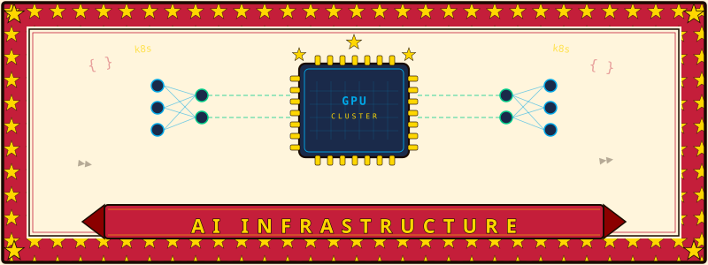

  

# AI Infrastructure Consultant Course

A self-paced curriculum to develop the skills required for Solutions Architect and Customer Engineer roles at AI cloud companies — and to operate as an independent consultant in the same ecosystem.

**Target roles:** AI/ML Specialist Solutions Architect · Solutions Architect (DevOps) · Customer Engineer · Key Customers Solutions Architect · Principal Solutions Architect

**Duration:** ~26 weeks full curriculum · ~14–16 weeks on the accelerated SA path

---

## Curriculum

### [Phase 1 — Foundations](./phase1-foundations/)
*Weeks 1–4 · Baseline skills every role assumes*

- [1.1 Python & Bash for ML Infra](./phase1-foundations/1.1-python-for-ml-infra/) — Python scripting + Bash automation for infra tasks. **Don't skip this if your primary language is Go.** The entire ML infra tooling ecosystem — PyTorch debugging, SLURM job scripts, benchmark harnesses, profiling tools — speaks Python. The gap is real and worth closing deliberately before Phase 2.
- [1.2 Cloud Fundamentals](./phase1-foundations/1.2-cloud-fundamentals/)
- [1.3 Linux & Containers](./phase1-foundations/1.3-linux-and-containers/) — RHEL/Ubuntu, OS-level security, kernel tuning
- [1.4 ML Concepts for Non-Researchers](./phase1-foundations/1.4-ml-concepts/)
- [1.5 GenAI Application Layer](./phase1-foundations/1.5-genai-application-layer/) — RAG architectures, fine-tuning vs. prompting decisions, agent/MCP patterns, NVIDIA NIM/NeMo, Nebius AI Studio. SA roles at AI clouds increasingly require talking about the workload, not just the infrastructure underneath it.

---

### [Phase 2 — GPU & ML Infrastructure](./phase2-gpu-ml-infra/)
*Weeks 5–11 · The technical core that differentiates this niche*

- [2.1 GPU Computing](./phase2-gpu-ml-infra/2.1-gpu-computing/) — CUDA, driver management, GPU profiling, NVIDIA tooling
- [2.2 ML Training at Scale](./phase2-gpu-ml-infra/2.2-ml-training-at-scale/)
- [2.3 Multi-node / Multi-GPU & HPC Networking](./phase2-gpu-ml-infra/2.3-multi-node-multi-gpu/) — RDMA, InfiniBand, RoCE, topology-aware scheduling
- [2.4 Inference Infrastructure](./phase2-gpu-ml-infra/2.4-inference-infrastructure/) — **Mini-phase scope (2 weeks).** This is where the overwhelming majority of customer demand sits in 2025–2026. vLLM, TensorRT-LLM, SGLang; KV cache management and memory layout; continuous batching; disaggregated prefill/decode; speculative decoding; $/token economics and serving cost modeling. Treat this as the single most important module in Phase 2.
- [2.5 Deep Learning Frameworks](./phase2-gpu-ml-infra/2.5-deep-learning-frameworks/)
- [2.6 HPC Cluster Management](./phase2-gpu-ml-infra/2.6-hpc-cluster-management/) — SLURM, MPI, enroot, NVIDIA Base Command Manager (BCM)
- [2.7 Storage for ML](./phase2-gpu-ml-infra/2.7-storage-for-ml/) — Parallel filesystems (Lustre, WEKA, VAST), object storage patterns for training datasets and checkpoints, checkpointing at scale, Nebius managed storage tiers. Comes up in nearly every training-infrastructure engagement and is interview-relevant at Nebius specifically.

---

### [Phase 3 — MLOps & Cloud Infrastructure](./phase3-mlops-cloud-infra/)
*Weeks 12–16 · The operational layer customers always struggle with*

- [3.1 Kubernetes for ML](./phase3-mlops-cloud-infra/3.1-kubernetes-for-ml/) — GPU Operator, Network Operator, Kubernetes scheduling for AI workloads
- [3.2 ML Orchestration](./phase3-mlops-cloud-infra/3.2-ml-orchestration/)
- [3.3 Infrastructure as Code](./phase3-mlops-cloud-infra/3.3-infrastructure-as-code/) — Terraform, Ansible, configuration management at scale
- [3.4 MLOps Pipelines](./phase3-mlops-cloud-infra/3.4-mlops-pipelines/)
- [3.5 Observability](./phase3-mlops-cloud-infra/3.5-observability/) — Prometheus, Grafana, Loki, GPU metrics, cluster health dashboards
- [3.6 CI/CD & DevOps for AI Infrastructure](./phase3-mlops-cloud-infra/3.6-cicd-devops/) — GitOps, pipeline design, software change management across infrastructure layers

---

### [Phase 4 — Solutions Architecture](./phase4-solutions-architecture/)
*Weeks 17–20 · Turning technical knowledge into deliverables*

- [4.1 Architecture Patterns](./phase4-solutions-architecture/4.1-architecture-patterns/)
- [4.2 PoC Design & Delivery](./phase4-solutions-architecture/4.2-poc-design-and-delivery/)
- [4.3 Architecture Reviews](./phase4-solutions-architecture/4.3-architecture-reviews/)
- [4.4 Technical Writing](./phase4-solutions-architecture/4.4-technical-writing/)
- [4.5 GPU Economics & Capacity Sizing](./phase4-solutions-architecture/4.5-gpu-economics-capacity-sizing/) — TCO modeling, GPU utilization math, reserved vs. spot, "how many H200s does this workload need." This is the single most common SA deliverable in pre-sales. Covers Nebius and cloud pricing models, memory/compute requirements for common model sizes, and building sizing calculators customers can use themselves.

---

### [Phase 5 — Client-Facing Skills](./phase5-client-facing-skills/)
*Weeks 21–23 · What separates a good engineer from a good consultant*

- [5.1 Discovery & Qualification](./phase5-client-facing-skills/5.1-discovery-and-qualification/)
- [5.2 Executive Communication](./phase5-client-facing-skills/5.2-executive-communication/)
- [5.3 Presales Mechanics](./phase5-client-facing-skills/5.3-presales-mechanics/)
- [5.4 Trusted Advisor Posture](./phase5-client-facing-skills/5.4-trusted-advisor-posture/)

---

### [Phase 6 — Capstone](./phase6-capstone/)
*Weeks 24–26 · Simulate a real consultant engagement end-to-end*

- [6.1 Architecture Proposal](./phase6-capstone/6.1-architecture-proposal/)
- [6.2 PoC Execution](./phase6-capstone/6.2-poc-execution/)
- [6.3 Executive Presentation](./phase6-capstone/6.3-executive-presentation/)
- [6.4 Technical Write-up](./phase6-capstone/6.4-technical-writeup/)

---

## How to Use This Course

Each module contains:
- `README.md` — objectives, concepts, and study notes
- `exercises/` — hands-on tasks
- `resources.md` — curated reading, docs, and videos

---

### Full curriculum path (~26 weeks)

Work through phases sequentially. Phases 1–3 are technical depth. Phases 4–5 are consultant craft. Phase 6 produces the portfolio artifacts that replace a company brand when working independently.

---

### Accelerated SA path (~14–16 weeks)

The 26-week sequential plan is optimized for completeness. If the goal is an SA/CE role in a specific timeframe, front-load the differentiating technical core and run client-facing skills in parallel.

**Sprint 1 (weeks 1–3) — Differentiating technical core**
2.3 Multi-node Networking → 2.6 HPC Cluster Management → 3.1 Kubernetes for ML

**Sprint 2 (weeks 4–6) — Inference (highest SA demand)**
2.4 Inference Infrastructure (full mini-phase scope: vLLM, TRT-LLM, KV cache, $/token)

**Sprint 3 (weeks 7–9) — GPU depth + storage**
2.1 GPU Computing → 2.2 ML Training at Scale → 2.7 Storage for ML

**Sprint 4 (weeks 10–11) — SA deliverables**
4.5 GPU Economics & Capacity Sizing → 4.1 Architecture Patterns → 4.2 PoC Design

**Sprint 5 (weeks 12–13) — Application layer + GenAI fluency**
1.5 GenAI Application Layer → 1.4 ML Concepts

**Run in parallel throughout:** Phase 5 client-facing skills (one session per week alongside technical sprints)

**Fast-track or skip entirely:** 1.2, 1.3 (strong prior knowledge), 3.3, 3.5, 3.6, 4.4 (existing DevOps background covers these)

---

### Do the exercises on Nebius

Spin up GPU instances on Nebius Cloud, use soperator for SLURM exercises, and document what you find. This solves GPU access, produces blog material for eeenotes.dev, and means you walk into any Nebius conversation as an actual user of their platform.

---

## Certifications

NVIDIA certifications are lightweight credibility signals that recruiters use as filters. The knowledge overlaps this course substantially — treat them as checkpoints, not as the goal.

| Cert | Code | Scope |
|---|---|---|
| NVIDIA-Certified Associate: Generative AI LLMs | NCA-GENL | GenAI application layer, LLM fundamentals, NIM |
| NVIDIA-Certified Professional: AI Operations | NCP-AIO | GPU infrastructure operations, cluster management, monitoring |

Complete NCA-GENL after Sprint 5. Complete NCP-AIO after Sprint 3.
